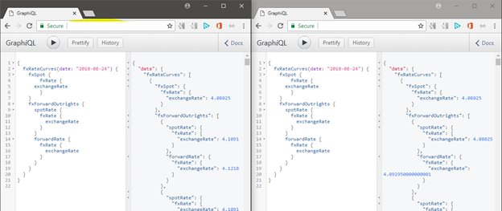
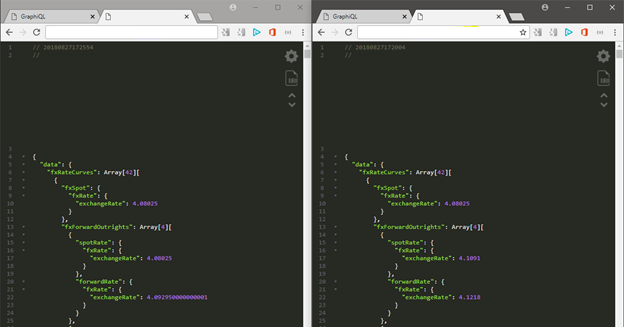
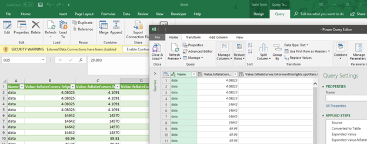
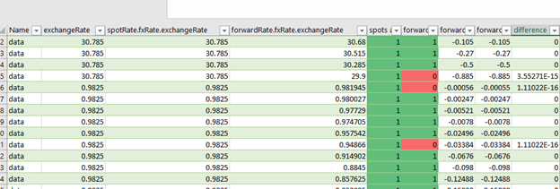

# Using GraphQL and Excel for test evidence in an API world

In our daily jobs, changes to our software landscape are recorded and reviewed to make sure it matches the company’s desired functionality. Testing software with a UI, is relatively straightforward for users, although it can be deceptively hard to prove that the magic under the hood actually does what it is supposed to. Web services (‘APIs’) can be tested more formally (‘do the numbers add up’) as they provide the raw data, which is either right or wrong, but do not tend to hand out information in a shape or form that easy to deal with from outside a code domain.

In the later versions of Excel and other Office applications, the query functionality has become powerful enough to query databases, web services and many other sources. Here we briefly discuss an approach to verify that a service works, whilst showing the power of the combination of GraphQL and Excel.

## The change

The change we were aiming for here, is that forward points on a curve are corrected to match the source of spot rate. The source for most forward points is Source 1 (S1), while for the spot rate we use Source 2 (S2). The formula is straightforward:

$$Forward_{\text{S2}} = Spot_{\text{S2}} + (Forward_{\text{S1}} - Spot_{\text{S1}})$$

The current production service shows the forwards in S1 and the spot in S2. The development service shows the spot and forward in S2, as the applied formula implies.

## Building evidence

In order to get result data from the service, we used GraphiQL to build queries:

Converting to URLs by changing …/graph **i** ql/… to …/graphql/…:

Now we have two JSON producing URLs of which the data can be compared. This is where Excel comes in.

## Loading data in Excel

Via the Data tab, it is possible to get data “From Web”, in which the URLs can simply be pasted. After expanding the JSON, that looks something like this:

Now, via very straightforward formulas and the power of Excel tables, we can create a comparison:

Which neatly shows differences and whether they are explainable.

## Evidence and other benefits

The great part about this, is that the evidence is complete: all the formulas and queries can be traced back to the URL proving that the test was performed comparing production against a development or test environment.

Moreover, it shows how easy it can be to construct datasets from APIs (or from Hadoop, as Excel supports that too) and run analytics on them.

Cool stuff!
